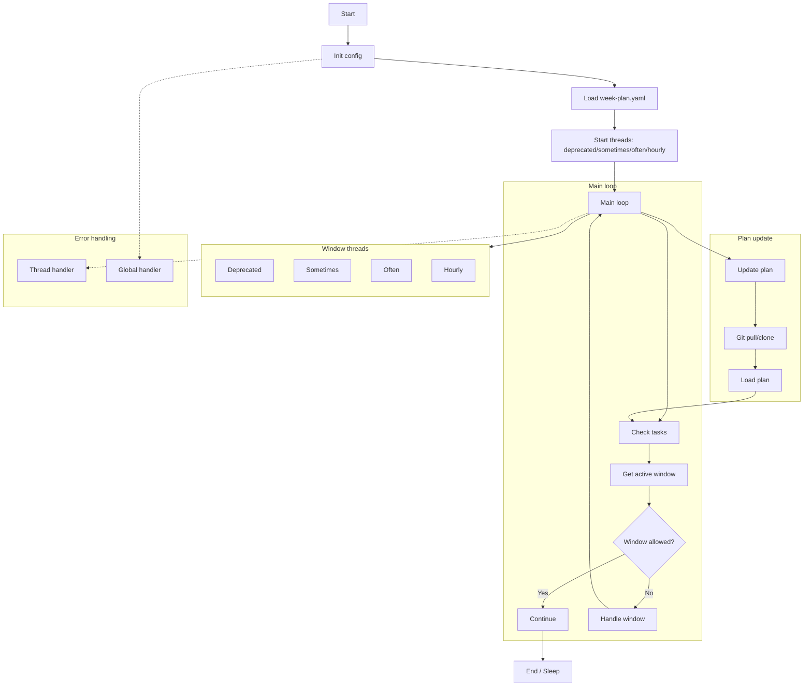

# time-management
Day plan, rules of day planning etc.

```mermaid
flowchart TD
%% === Основной поток ===
A[Start] --> B[Init config]
B --> C[Load week-plan.yaml]
C --> D[Start threads: deprecated/sometimes/often/hourly]
D --> E[Main loop]

%% === Главный цикл ===
subgraph MAIN_LOOP[Main loop]
    E --> F[Check tasks]
    F --> G[Get active window]
    G --> H{Window allowed?}
    H -- Yes --> I[Continue]
    H -- No --> J[Handle window]
    J --> E
end

%% === Потоки проверки окон ===
subgraph THREADS[Window threads]
    direction TB
    T1[Deprecated]
    T2[Sometimes]
    T3[Often]
    T4[Hourly]
end

E --> THREADS

%% === Обновление плана ===
subgraph UPDATE_PLAN[Plan update]
    U1[Update plan] --> U2[Git pull/clone]
    U2 --> U3[Load plan]
end

E --> U1
U3 --> F

%% === Ошибки ===
subgraph ERRORS[Error handling]
    direction TB
    X1[Thread handler]
    X2[Global handler]
end
E -.-> X1
B -.-> X2

%% === Завершение ===
I --> Z[End / Sleep]
```